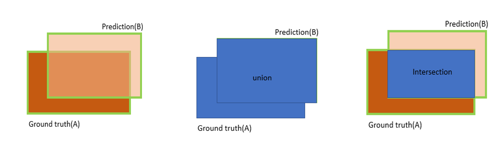
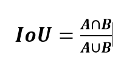
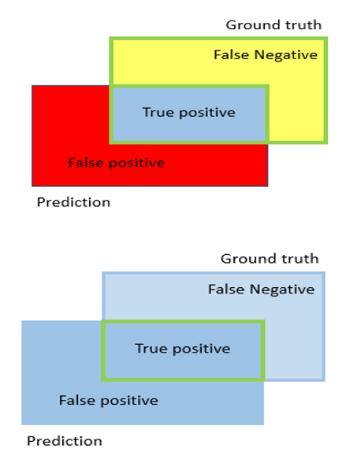
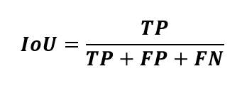
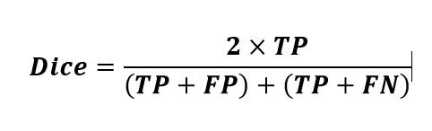
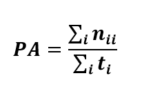
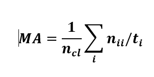
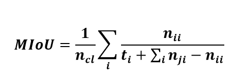
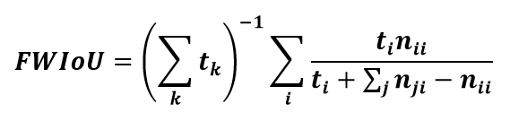

# [Evaluation-Criteria](https://github.com/A2Amir/Evaluation-Criteria-for-Segmentation-Networks/blob/master/Evaluate.ipynb):
The segmentation quality evaluation is very vital for image processing, particularly in security cases, including autonomous vehicles.
There are many evaluation criteria developed for segmentation evaluation so that researchers can make a choice based on their needs. 
It’s worth noting that there isn’t any collectively consented technique to make this choice [1][2].
It should be remembered that the task of  segmentation is simply to predict the class of each pixel in an image and the predicted output’s shape matches the input shape in terms of width, height, and depth.

##  The most well-known and common criteria used by researchers are:

#####	1.  Jaccard similarity: deduced from the Intersection over Union (IoU) metric. This criterion is employed to quantify the overlap between the predicted output and ground truth. For example, by taking into account the ground truth, the IoU score of the following prediction can be calculated as follows. 

The Intersection over Union (IoU) example source

  
The IoU metric is calculated by dividing the number of the pixels common between the ground truth (A) and 
  predicted output (B) by the total number of pixels present across both.
  
  

  The term A∩B implies the pixels belonging to both the ground truth (A) and prediction (B) areas are shown while the term A∪B implies all the pixels present in each of these areas. Finally, given that each class has it's our IoU score, a global mean IoU score is obtained by averaging all classes’ IoU scores. 
  
#####	2. [Dice similarity coefficient](https://en.wikipedia.org/wiki/S%C3%B8rensen%E2%80%93Dice_coefficient) : This criterion determines the similarity between the results of segmentation and its corresponding ground truths in a slightly different way. Because of its more simplicity, we first consider the IoU metric.

The Intersection over Union example for the dice similarity coefficient source

  
Assume that the “ground truth” box represents the segmentation region deduced by people and the “prediction” box represents the segmentation resulted from a deep learning technique—both on the same image. The blue rectangle is the overlapping area (between two mentioned boxes) and shows the region in which pixels matching the ground truth can be detected by a segmentation model. These pixels are called true positives (TP). Also, the red region includes the pixels called false positives (FP).
Furthermore, the yellow region possesses the pixels, which are missed from segmentation and called false negatives (FN). When the overlapping area completely covers the union area, the segmentation is flawless, the value of IoU criterion is 1, and the values of FP, TP, and FN are zero. Therefore, the IoU criterion [formula](https://medium.com/datadriveninvestor/deep-learning-in-medical-imaging-3c1008431aaf) can be rewritten as follows:

  

 Also, the Dice Similarity Coefficient can be calculated as [follows]()
 
   

##### 3. In the following, we introduce four evaluation metrics. Inspired from the paper entitled “Fully Convolutional Networks for Semantic Segmentation [3]”, these metrics are extracted based on pixel accuracy and IoU metric.  [Code](https://github.com/A2Amir/Evaluation-Criteria-for-Segmentation-Networks/blob/master/Evaluate.ipynb). 

Regarding the notations in this paper[3]:

	* n_cl: the number of classes.
	* t_i: the total number of pixels in class i.
	* n_ij: the number of pixels of class we predicted to belong to class j. 
	* n_ii: the number of correctly classified pixels (true positives).
	* n_ij: the number of pixels wrongly classified (false positives).
	* n_ji: the number of pixels wrongly not classified (false negatives).

3.1 Pixel Accuracy (PA): as overall accuracy, it can be calculated as follows [4],[5]

3.2 Mean Accuracy (MA): is the average accuracy among all the classes related to ground truths. This metric can be calculated as follows [4],[5]. 

3.3 Mean Intersection over Union (MIoU): is commonly used for semantic segmentation performance evaluation and can be calculated as follows [4], [5].

	
3.4 Frequency weighted intersection over union (FWIoU): the difference between this metric and MIoU is that it considers the number of data points in each class [4], [5]

	
	
It’s worth noting that unlike MIoU and FWIoU, the other two metrics mentioned above aren’t susceptible to unbalanced datasets [5].

---
[1]	A. A. Taha, A. Hanbury, and O. A. J. del Toro, “A formal method for selecting evaluation metrics for image segmentation,” in 2014 IEEE International Conference on Image Processing (ICIP), 2014, pp. 932–936.

[2]	M. Möller, L. Lymburner, and M. Volk, “The comparison index: A tool for assessing the accuracy of image segmentation,” Int. J. Appl. Earth Obs. Geoinf., vol. 9, no. 3, pp. 311–321, 2007.

[3]	J. Long, E. Shelhamer, and T. Darrell, “Fully convolutional networks for semantic segmentation,” in Proceedings of the IEEE conference on computer vision and pattern recognition, 2015, pp. 3431–3440.

[4]	J. Long, E. Shelhamer, and T. Darrell, “Fully convolutional networks for semantic segmentation,” in Proceedings of the IEEE conference on computer vision and pattern recognition, 2015, pp. 3431–3440.

[5]	S. Haugen, A. Barros, C. van Gulijk, T. Kongsvik, and J. E. Vinnem, Safety and Reliability – Safe Societies in a Changing World: Proceedings of ESREL 2018, June 17-21, 2018, Trondheim, Norway. CRC Press, 2018.

